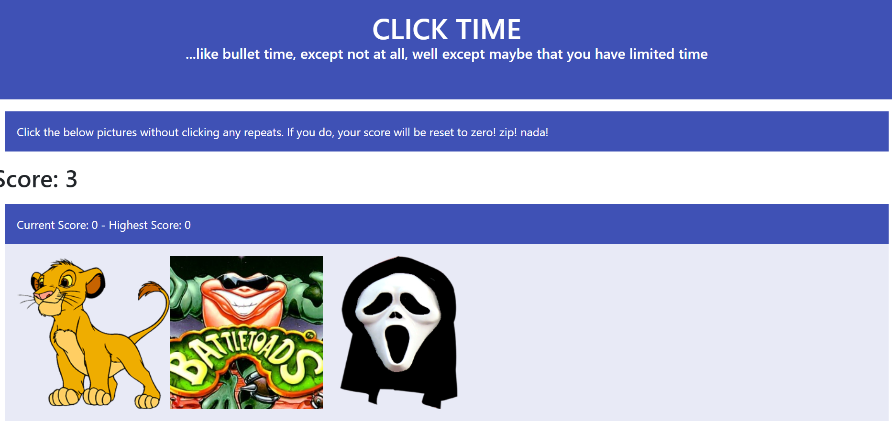

# react-click-time
A memory game where you have to click things, and then remember those things you clicked, so you don't accidentally click them again, or else you lose.....................created with React!!

## How To Play
1. Click on an image. 
2. The images will shuffle.
3. Click on an image you haven't already clicked on. You get one point for doing so. 
4. Get the max score to beat the game, but beware, click on the wrong image and your score goes back to 0. 

## Note: This application is under construction and is not fully functional yet. 